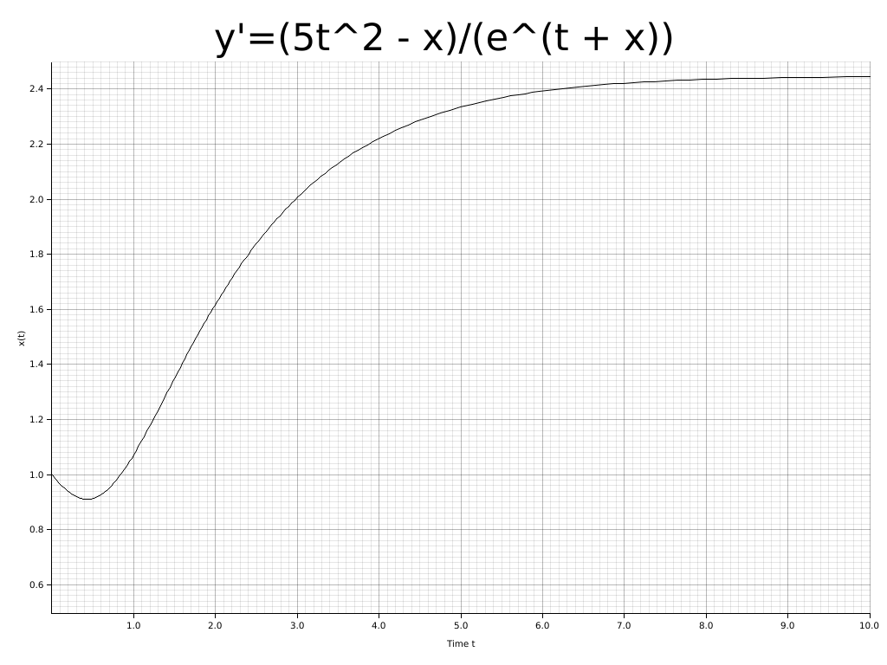

# mathru

[](https://crates.io/crates/mathru)
[](https://docs.rs/mathru)


------------
mathru is a numeric library containing algorithms for linear algebra, analysis and statistics written in pure Rust with BLAS/LAPACK support.

## Features
    - Linear algebra
        - Vector
        - Matrix
            - Basic matrix operations(+,-,*)
            - Transposition
            - LU decomposition (native/lapack)
            - QR decomposition (native/lapack)
            - Hessenberg decomposition (native/lapack)
            - Singular value decomposition
            - Inverse (native/lapack)
            - Pseudo inverse (native/lapack)
            - Determinant (native/lapack)
            - Trace
            - Eigenvalue (native/lapack)

    - Ordinary differential equation (ODE)
        - Explicit methods
            - Heun's method
            - Euler method
            - Midpoint method
            - Ralston's method
            - Kutta 3rd order
            - Runge-Kutta 4th order
            - Runge-Kutta-Felhberg 4(5)
            - Dormand-Prince 4(5)
            - Cash-Karp 4(5)
            - Tsitouras 4(5)
            - Bogacki-Shampine 4(5)
        - Automatic step size control with starting step size
        
    - Optimization
        - Gauss-Newton algorithm
        - Gradient descent
        - Newton method
        - Levenberg-Marquardt algorithm
        - Conjugate gradient method

    - Statistics
        - probability distribution
            - Bernoulli
            - Beta
            - Binomial
            - Chisquared
            - Exponential
            - Gamma
            - Chi-squared
            - Multinomial
            - Normal
            - Poisson
            - Raised cosine
            - Student-t
            - Uniform
        - test
            - Chi-squared 
            - G
            - Student-t

    - elementary functions
        - trigonometric functions
        - hyperbolic functions
        - exponential functions

    - special functions
        - gamma functions
        - beta functions
        - hypergeometrical functions
## Usage

Add this to your `Cargo.toml` for the native Rust implementation:

```toml
[dependencies.mathru]
version = "0.6"
```
Add the following lines to 'Cargo.toml' if the blas/lapack backend should be used:

```toml
[dependencies.mathru]
version = "0.6"
default-features = false
features = ["blaslapack"]
```

Then import the modules and it is ready to be used:

```rust
use mathru::algebra::linear::{Matrix};

// Compute the LU decomposition of a 2x2 matrix
let a: Matrix<f64> = Matrix::new(2, 2, vec![1.0, -2.0, 3.0, -7.0]);
let l_ref: Matrix<f64> = Matrix::new(2, 2, vec![1.0, 0.0, 1.0 / 3.0, 1.0]);

let (l, u, p): (Matrix<f64>, Matrix<f64>, Matrix<f64>) = a.dec_lu();

assert_eq!(l_ref, l);
```

Solve an ODE with initial condition:

```rust
use mathru::*;
use mathru::algebra::linear::{Vector};
use mathru::analysis::ode::{DormandPrince54};
use mathru::analysis::ode::ExplicitODE;

// Define the ODE
// x' = (5t^2 - x) / e^(t + x) `$
// x(0) = 1
pub struct ExplicitODE1
{
	time_span: (f64, f64),
	init_cond: Vector<f64>
}

impl Default for ExplicitODE1
{
	fn default() -> ExplicitODE1
	{
		ExplicitODE1
		{
			time_span: (0.0, 10.0),
			init_cond: vector![1.0],
		}
	}
}

impl ExplicitODE<f64> for ExplicitODE1
{
   	fn func(self: &Self, t: &f64, x: &Vector<f64>) -> Vector<f64>
	{
		return vector!((5.0 * t * t - *x.get(0)) / (t + *x.get(0)).exp());
	}
    
    // Returns the time span
    fn time_span(self: &Self) -> (f64, f64)
	{
		return self.time_span;
	}

    // Initial value at x(0)
    fn init_cond(self: &Self) -> Vector<f64>
	{
		return self.init_cond.clone();
	}
}


fn main() {
	let h_0: f64 = 0.001;
	let n_max: u32 = 300;
	let abs_tol: f64 = 10e-7;

	let solver: DormandPrince54<f64> = DormandPrince54::new(abs_tol, h_0, n_max);

	let (t, x): (Vec<f64>, Vec<Vector<f64>>) = solver.solve(&problem).unwrap();
}
```



## Contributions

Any contribution is welcome!
