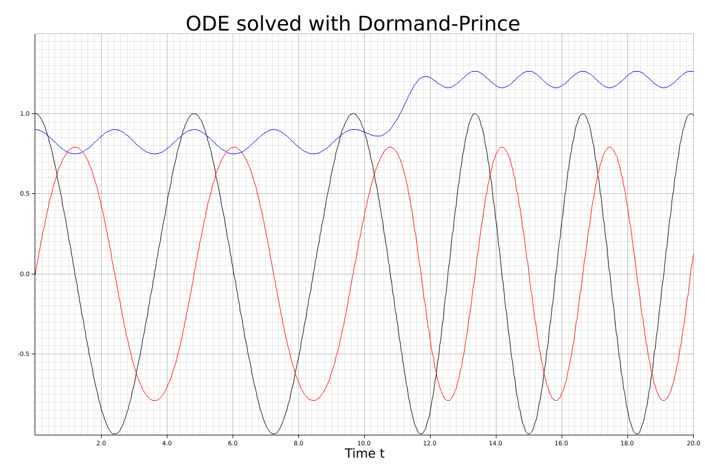
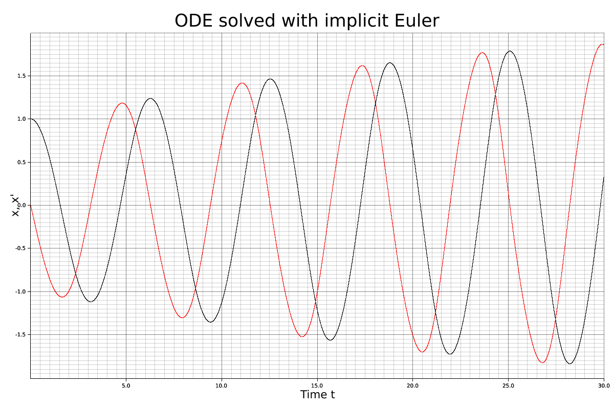
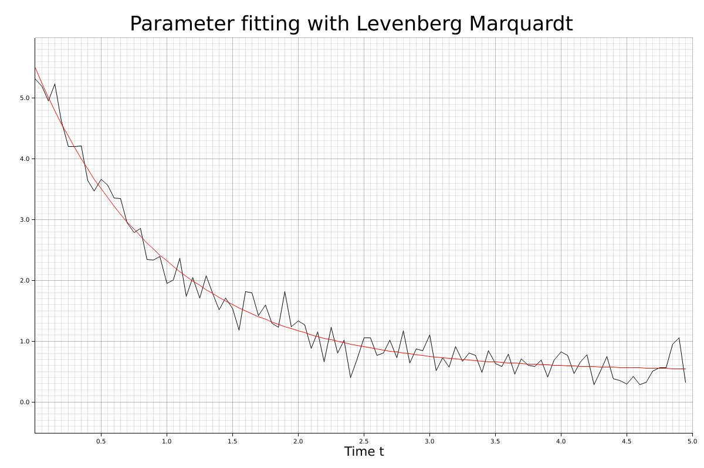

# mathru

[](https://crates.io/crates/mathru)
[](https://docs.rs/mathru)


[](https://gitlab.com/matthiaseiholzer/mathru/-/commits/master)
------------
mathru is a numeric library containing algorithms for linear algebra, analysis and statistics written in pure Rust with BLAS/LAPACK support.

## Features
    - Linear algebra
        - Vector
        - Matrix
            - Basic matrix operations(+,-,*)
            - Transposition
            - LU decomposition (native/lapack)
            - QR decomposition (native/lapack)
            - Hessenberg decomposition (native/lapack)
            - Singular value decomposition
            - Inverse (native/lapack)
            - Pseudo inverse (native/lapack)
            - Determinant (native/lapack)
            - Trace
            - Eigenvalue (native/lapack)

    - Ordinary differential equation (ODE)
        - Explicit methods
            - Heun's method
            - Euler method
            - Midpoint method
            - Ralston's method
            - Kutta 3rd order
            - Runge-Kutta 4th order
            - Runge-Kutta-Felhberg 4(5)
            - Dormand-Prince 4(5)
            - Cash-Karp 4(5)
            - Tsitouras 4(5)
            - Bogacki-Shampine 2(3)
            - Adams-Bashforth
        - Automatic step size control with starting step size
        - Implizit methods
            - Implizit Euler
             
    - Optimization
        - Gauss-Newton algorithm
        - Gradient descent
        - Newton method
        - Levenberg-Marquardt algorithm
        - Conjugate gradient method

    - Statistics
        - probability distribution
            - Bernoulli
            - Beta
            - Binomial 
            - Exponential
            - Gamma
            - Chi-squared
            - Normal
            - Poisson
            - Raised cosine
            - Student-t
            - Uniform
        - test
            - Chi-squared 
            - G
            - Student-t

    - elementary functions
        - trigonometric functions
        - hyperbolic functions
        - exponential functions

    - special functions
        - gamma functions
        - beta functions
        - hypergeometrical functions
## Usage

Add this to your `Cargo.toml` for the native Rust implementation:

```toml
[dependencies.mathru]
version = "^0.6"
```
Add the following lines to 'Cargo.toml' if the blas/lapack backend should be used:

```toml
[dependencies.mathru]
version = "^0.6"
default-features = false
features = ["blaslapack"]
```

Then import the modules and it is ready to be used.

## Example

### Calculate the LU decomposition of a matrix
```rust
use mathru::algebra::linear::{Matrix};

// Compute the LU decomposition of a 2x2 matrix
let a: Matrix<f64> = Matrix::new(2, 2, vec![1.0, -2.0, 3.0, -7.0]);
let l_ref: Matrix<f64> = Matrix::new(2, 2, vec![1.0, 0.0, 1.0 / 3.0, 1.0]);

let (l, u, p): (Matrix<f64>, Matrix<f64>, Matrix<f64>) = a.dec_lu();

assert_eq!(l_ref, l);
```

### Solve an initial value problem with Dormand-Prince method:

```rust
use mathru::algebra::linear::{Vector};
use mathru::analysis::ode::{ExplicitODE, DormandPrince54};
use mathru::analysis::ode::problem::Euler;
use plotters::prelude::*;

fn main()
{
    // Create an ODE instance
    let problem: Euler<f64> = Euler::default();

    let (x_start, x_end) = problem.time_span();
    
    // Create a ODE solver instance
    let h_0: f64 = 0.001;
    let n_max: u32 = 800;
    let abs_tol: f64 = 10e-7;
    
    let solver: DormandPrince54<f64> = DormandPrince54::new(abs_tol, h_0, n_max);

    // Solve ODE
    let (x, y): (Vec<f64>, Vec<Vector<f64>>) = solver.solve(&problem).unwrap();

    //Create chart
    let mut graph_x1: Vec<(f64, f64)> = Vec::with_capacity(x.len());
    let mut graph_x2: Vec<(f64, f64)> = Vec::with_capacity(x.len());
    let mut graph_x3: Vec<(f64, f64)> = Vec::with_capacity(x.len());

    for i in 0..x.len()
    {
        let x_i = x[i];
        graph_x1.push((x_i, *y[i].get(0)));
        graph_x2.push((x_i, *y[i].get(1)));
        graph_x3.push((x_i, *y[i].get(2)));
    }
    
    let root_area = BitMapBackend::new("../figure/ode_explicit.png", (1200, 800))
        .into_drawing_area();
    root_area.fill(&WHITE).unwrap();

    let mut ctx = ChartBuilder::on(&root_area)
        .margin(20)
        .set_label_area_size(LabelAreaPosition::Left, 40)
        .set_label_area_size(LabelAreaPosition::Bottom, 40)
        .caption("ODE solved with Dormand-Prince", ("Arial", 40))
        .build_ranged(x_start..x_end, -1.0f64..1.5f64)
        .unwrap();

    ctx.configure_mesh()
        .x_desc("Time t")
        .axis_desc_style(("sans-serif", 25).into_font())
        .draw().unwrap();


    ctx.draw_series(LineSeries::new(graph_x1, &BLACK)).unwrap();

    ctx.draw_series(LineSeries::new(graph_x2, &BLACK)).unwrap();

    ctx.draw_series(LineSeries::new(graph_x3, &BLACK)).unwrap();
}
```



### Solve an initial value problem with implicit Euler method:

```rust
use mathru::algebra::linear::{Vector};
use mathru::analysis::ode::{ImplicitODE, ImplicitEuler};
use mathru::analysis::ode::problem::VanDerPolOsc;
use plotters::prelude::*;

fn main()
{
    // Create an ODE instance
    let problem: VanDerPolOsc<f64> = VanDerPolOsc::default();

    // Create a ODE solver instance
    let solver: ImplicitEuler<f64> = ImplicitEuler::new(0.0005);

    // Solve ODE
    let (t, x): (Vec<f64>, Vec<Vector<f64>>) = solver.solve(&problem).unwrap();

    //Create chart
    let mut graph_x1: Vec<(f64, f64)> = Vec::with_capacity(x.len());
    let mut graph_x2: Vec<(f64, f64)> = Vec::with_capacity(x.len());

    for i in 0..x.len()
    {
        let t_i = t[i];
        graph_x1.push((t_i, *x[i].get(0)));
        graph_x2.push((t_i, *x[i].get(1)));
    }
    
    let root_area = BitMapBackend::new("../figure/ode_implicit.png", (1200, 800))
        .into_drawing_area();
    
    root_area.fill(&WHITE).unwrap();
    
    let (t_start, t_end) = problem.time_span();
    
    let mut ctx = ChartBuilder::on(&root_area)
        .margin(20)
        .set_label_area_size(LabelAreaPosition::Left, 40)
        .set_label_area_size(LabelAreaPosition::Bottom, 40)
        .caption("ODE solved with implicit Euler", ("Arial", 40))
        .build_ranged(t_start..t_end, -2.0f64..2.0f64)
        .unwrap();

    ctx.configure_mesh()
        .x_desc("Time t")
        .y_desc("x, x'")
        .axis_desc_style(("sans-serif", 25).into_font())
        .draw().unwrap();
        
    ctx.draw_series(LineSeries::new(graph_x1, &BLACK)).unwrap();
    
    ctx.draw_series(LineSeries::new(graph_x2, &RED)).unwrap();
}
```



### Fitting with Levenberg-Marquardt

```rust
use mathru::*;
use mathru::algebra::linear::{Vector, Matrix};
use mathru::statistics::distrib::{Distribution, Normal};
use mathru::optimization::{Optim, LevenbergMarquardt};
use plotters::prelude::*;

///y = a + b * exp(c * t) = f(t)
pub struct Example
{
    x: Vector<f64>,
    y: Vector<f64>
}

impl Example
{
    pub fn new(x: Vector<f64>, y: Vector<f64>) -> Example
    {
        Example
        {
            x: x,
            y: y
        }
    }
    
    pub fn function(x: f64, beta: &Vector<f64>) -> f64
    {
        let beta_0: f64 = *beta.get(0);
        let beta_1: f64 = *beta.get(1);
        let beta_2: f64 = *beta.get(2);
        let f_x: f64 = beta_0 + beta_1 * (beta_2 * x).exp();
        
        return f_x;
    }
}

impl Optim<f64> for Example
{
    // y(x_i) - f(x_i)
    fn eval(self: &Self, beta: &Vector<f64>) -> Vector<f64>
    {
        let f_x = self.x.clone().apply(&|x: &f64| Example::function(*x, beta));
        let r: Vector<f64> = &self.y - &f_x;
        return vector![r.dotp(&r)]
    }
    
    fn jacobian(self: &Self, beta: &Vector<f64>) -> Matrix<f64>
    {
        let (x_m, _x_n) = self.x.dim();
        let (beta_m, _beta_n) = beta.dim();
        
        let mut jacobian_f: Matrix<f64> = Matrix::zero(x_m, beta_m);
        
        let f_x = self.x.clone().apply(&|x: &f64| Example::function(*x, beta));
        
        let residual: Vector<f64> = &self.y - &f_x;
        
        for i in 0..x_m
        {
            let beta_1: f64 = *beta.get(1);
            let beta_2: f64 = *beta.get(2);
            
            let x_i: f64 = *self.x.get(i);
            
            *jacobian_f.get_mut(i, 0) = 1.0;
            *jacobian_f.get_mut(i, 1) = (beta_2 * x_i).exp();
            *jacobian_f.get_mut(i, 2) = beta_1 * x_i * (beta_2 * x_i).exp();
            
        }
        
        let jacobian: Matrix<f64> = (residual.transpose() * jacobian_f * -2.0).into();
        return jacobian;
    }
}

fn main()
{
    let num_samples: usize = 100;
    
    let noise: Normal<f64> = Normal::new(0.0, 0.05);
    
    let mut t_vec: Vec<f64> = Vec::with_capacity(num_samples);
    
    // Start time
    let t_0 = 0.0f64;
    // End time
    let t_1 = 5.0f64;
    
    let mut x_vec: Vec<f64> = Vec::with_capacity(num_samples);
    
    // True function parameters
    let beta: Vector<f64> = vector![0.5; 5.0; -1.0];
    
    for i in 0..num_samples
    {
        let t_i: f64 = (t_1 - t_0) / (num_samples as f64) * (i as f64);
        
        //Add some noise
        x_vec.push(Example::function(t_i, &beta) + noise.random());
        t_vec.push(t_i);
    }
    
    let t: Vector<f64> = Vector::new_column(num_samples, t_vec.clone());
    let x: Vector<f64> = Vector::new_column(num_samples, x_vec.clone());
    
    let example_function = Example::new(t, x);
    
    let optim: LevenbergMarquardt<f64> = LevenbergMarquardt::new(100, 0.3, 0.95);
   
    // Fit parameter
    let beta_0: Vector<f64> = vector![-1.5; 1.0; -2.0];
    let beta_opt: Vector<f64> = optim.minimize(&example_function, &beta_0).arg();
    
    //Create chart
    let mut graph_x: Vec<(f64, f64)> = Vec::with_capacity(x_vec.len());
    let mut graph_x_hat: Vec<(f64, f64)> = Vec::with_capacity(x_vec.len());
    
    for i in 0..x_vec.len()
    {
        let t_i = t_vec[i];
        graph_x.push((t_i, x_vec[i]));
        
        let x_hat = Example::function(t_i, &beta_opt);
        graph_x_hat.push((t_i, x_hat));
    }
    
    let root_area = BitMapBackend::new("../figure/fit_lm.png", (1200, 800))
        .into_drawing_area();
    root_area.fill(&WHITE).unwrap();

    let mut ctx = ChartBuilder::on(&root_area)
        .margin(20)
        .set_label_area_size(LabelAreaPosition::Left, 40)
        .set_label_area_size(LabelAreaPosition::Bottom, 40)
        .caption("Parameter fitting with Levenberg Marquardt", ("Arial", 40))
        .build_ranged(t_0..t_1, -0.5f64..6.0f64)
        .unwrap();

    ctx.configure_mesh()
        .x_desc("Time t")
        .axis_desc_style(("sans-serif", 25).into_font())
        .draw().unwrap();


    ctx.draw_series(LineSeries::new(graph_x, &BLACK)).unwrap();

    ctx.draw_series(LineSeries::new(graph_x_hat, &RED)).unwrap();
}
```


## License

Licensed under

 * MIT license ([LICENSE-MIT](LICENSE-MIT) or http://opensource.org/licenses/MIT)

### Contribution

Any contribution is welcome!
